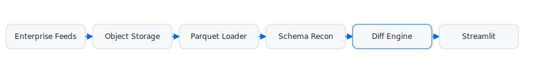
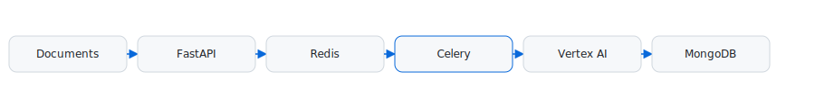
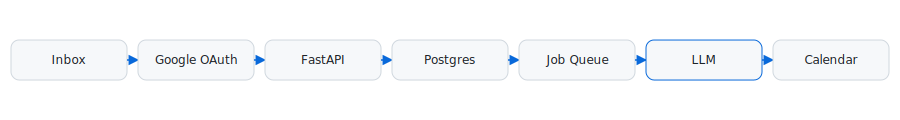
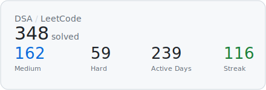

<picture>
  <source media="(prefers-color-scheme: dark)" srcset="assets/hero-dark.svg">
  
</picture>

### Now

<!-- NOW:START -->
- **Building** — Enterprise Run Comparison Platform @ Citi
- **Learning** — Kubernetes, Go concurrency
- **Reading** — Designing Data-Intensive Applications
- **Interested in** — Distributed systems, AI infrastructure, developer tooling
<!-- NOW:END -->

### Engineering Philosophy

`Reliability over cleverness` · `Observability over assumptions` · `Automation over repetition` · `Simple systems scale` · `Good APIs disappear`

---

### Experience

**Citi** — Technology Summer Analyst (SDE Intern) · Jun 2026 – Present

<picture><source media="(prefers-color-scheme: dark)" srcset="assets/arch-citi-dark.svg"></picture>

- Architected an enterprise feed **Run Comparison platform** — Parquet ingestion, schema reconciliation, diff generation, hybrid caching — replacing manual comparison workflows.
- Built a zero-copy Parquet streaming loader: **8-worker** parallel loading across hierarchical object storage, **200K+ records**.
- Shipped **6 modules** with **25+ automated tests**; cut latency via incremental pagination + memoized diffs.

**AI-Mond** — SDE Intern · Feb 2026 – Jun 2026

<picture><source media="(prefers-color-scheme: dark)" srcset="assets/arch-aimond-dark.svg"></picture>

- Engineered a high-throughput async document pipeline (FastAPI · Redis · Celery · MongoDB/Beanie); eliminated N+1 queries via batch aggregation.
- Integrated **Gemini via Vertex AI** for entity extraction with HTTP 429 retry/backoff.
- Added **SSE** real-time task streaming and owner-scoped CRUD with strict **RBAC/JWT**.

---

### Featured Projects

**Syncule** — Email intelligence platform · `FastAPI · Postgres · Prisma · Docker · LLMs`

<picture><source media="(prefers-color-scheme: dark)" srcset="assets/arch-syncule-dark.svg"></picture>

Automated email ingestion, interest-based filtering, and calendar sync — Google OAuth, idempotent job queues, and a containerized async LLM pipeline. → [`raisaaajose/event-tracker-v2`](https://github.com/raisaaajose/event-tracker-v2)

**DEVSOC'25 Backend** — Hackathon platform · `Go · Postgres · Docker`

<picture><source media="(prefers-color-scheme: dark)" srcset="assets/arch-devsoc-dark.svg"></picture>

Served **1,200 concurrent users at 99.9% uptime**; **+35%** API latency via query optimization, indexing, and connection pooling; JWT refresh tokens + OTP email verification. → [`CodeChefVIT/devsoc-be-25`](https://github.com/CodeChefVIT/devsoc-be-25)

<table>
<tr>
<td width="50%" valign="top">

**VITTY** · `Kotlin`

Shipped Android timetable app — **10k+ downloads · 31★**. → [`GDGVIT/vitty-app`](https://github.com/GDGVIT/vitty-app)

</td>
<td width="50%" valign="top">

**Flutter Glimpse** · `Dart`

Server-Driven UI package (JSON + gRPC). → [`GDGVIT/flutter-glimpse`](https://github.com/GDGVIT/flutter-glimpse)

</td>
</tr>
</table>

---

### Tech Stack

**Languages** · Go · Python · Java · TypeScript · Kotlin · Dart · SQL
**Backend** · FastAPI · Gin · Fiber · Echo · Chi · Node.js · Celery
**Databases & Caching** · Postgres · MongoDB · MySQL · Redis
**Infra & DevOps** · Docker · AWS (EC2/Lambda/S3) · Git · Firebase
**AI** · Vertex AI · Gemini · LLMs · RAG

---

### DSA

<picture>
  <source media="(prefers-color-scheme: dark)" srcset="assets/leetcode-dark.svg">
  
</picture>

---

### Stats

<picture>
  <source media="(prefers-color-scheme: dark)" srcset="https://github-readme-stats.vercel.app/api?username=JothishKamal&show_icons=true&hide_border=true&theme=github_dark&bg_color=0D1117&title_color=00ADD8&icon_color=00ADD8&text_color=E6EDF3">
  
</picture>

<!-- metrics.svg is committed by the metrics workflow once METRICS_TOKEN is set -->

---

### Contact

[GitHub](https://github.com/JothishKamal) · [LeetCode](https://leetcode.com/u/JothishKamal/) · [Email](mailto:jothishkamal@gmail.com)

<!--
$ whoami
Jothish Kamal — Backend Engineer
TODO: build something worth maintaining. repeat.
-->
