<picture>
  <source media="(prefers-color-scheme: dark)" srcset="assets/hero-dark.svg">
  
</picture>

<picture>
  <source media="(prefers-color-scheme: dark)" srcset="assets/services-dark.svg">
  
</picture>

### Current Focus

<!-- NOW:START -->
`●` **Building** — Enterprise Run Comparison Platform @ Citi  
`●` **Learning** — Kubernetes · Go concurrency  
`●` **Reading** — Designing Data-Intensive Applications  
`●` **Status** — Available for backend engineering roles
<!-- NOW:END -->

### Engineering Philosophy

`Reliability over cleverness` · `Observability over assumptions` · `Automation over repetition` · `Simple systems scale` · `Good APIs disappear`

---

### Experience

**Citi** — Technology Summer Analyst (SDE Intern) · Jun 2026 – Present

<picture><source media="(prefers-color-scheme: dark)" srcset="assets/arch-citi-dark.svg"></picture>

> **Problem** — Manual, error-prone reconciliation between consecutive enterprise feed runs.  
> **Solution** — A schema-aware Parquet comparison engine with zero-copy streaming, parallel loading, and hybrid caching.  
> **Impact** — `200K+ records` · `8-worker loading` · `6 modules` · `25+ automated tests`

**AI-Mond** — SDE Intern · Feb 2026 – Jun 2026

<picture><source media="(prefers-color-scheme: dark)" srcset="assets/arch-aimond-dark.svg"></picture>

> **Problem** — Slow, N+1-bound document processing with no real-time feedback.  
> **Solution** — Async FastAPI · Redis · Celery pipeline with batch aggregation and Gemini (Vertex AI) extraction.  
> **Impact** — `SSE streaming` · `429 retry/backoff` · `RBAC/JWT` · `28 rule functions`

---

### Featured Projects

**Syncule** — Email intelligence platform · `FastAPI · Postgres · Prisma · Docker · LLMs`

<picture><source media="(prefers-color-scheme: dark)" srcset="assets/arch-syncule-dark.svg"></picture>

Automated email ingestion, interest-based filtering, and calendar sync — Google OAuth, idempotent job queues, and a containerized async LLM pipeline. → [`raisaaajose/event-tracker-v2`](https://github.com/raisaaajose/event-tracker-v2)

**DEVSOC'25 Backend** — Hackathon platform · `Go · Postgres · Docker`

<picture><source media="(prefers-color-scheme: dark)" srcset="assets/arch-devsoc-dark.svg"></picture>

Served **1,200 concurrent users at 99.9% uptime**; **+35%** API latency via query optimization, indexing, and connection pooling; JWT refresh tokens + OTP email verification. → [`CodeChefVIT/devsoc-be-25`](https://github.com/CodeChefVIT/devsoc-be-25)

<table>
<tr>
<td width="50%" valign="top">

**VITTY** · `Kotlin`

Shipped Android timetable app — **10k+ downloads · 31★**. → [`GDGVIT/vitty-app`](https://github.com/GDGVIT/vitty-app)

</td>
<td width="50%" valign="top">

**Flutter Glimpse** · `Dart`

Server-Driven UI package (JSON + gRPC). → [`GDGVIT/flutter-glimpse`](https://github.com/GDGVIT/flutter-glimpse)

</td>
</tr>
</table>

---

### Tech Stack

<table>
<tr>
<td width="25%" valign="top">

**Languages**

Go  
Python  
Java  
TypeScript  
SQL

</td>
<td width="25%" valign="top">

**Backend**

FastAPI  
Gin · Fiber  
Node.js  
Celery

</td>
<td width="25%" valign="top">

**Infrastructure**

Docker  
AWS  
Postgres · Redis  
MongoDB

</td>
<td width="25%" valign="top">

**AI**

Vertex AI  
Gemini  
LLMs  
RAG

</td>
</tr>
</table>

---

### DSA

<picture>
  <source media="(prefers-color-scheme: dark)" srcset="assets/leetcode-dark.svg">
  
</picture>

---

### Stats

<picture>
  <source media="(prefers-color-scheme: dark)" srcset="https://raw.githubusercontent.com/JothishKamal/JothishKamal/output/snake-dark.svg">
  
</picture>

<!-- metrics.svg (languages + activity only) is committed by the metrics workflow once METRICS_TOKEN is set -->

---

### Contact

`$ contact`

→ [github](https://github.com/JothishKamal)  
→ [leetcode](https://leetcode.com/u/JothishKamal/)  
→ [linkedin](https://www.linkedin.com/in/jothishkamal/)  
→ [email](mailto:jothishkamal@gmail.com)

---

<!-- DEPLOYED:START -->last deployed 2026-07-22 · generated with GitHub Actions · status: ● online<!-- DEPLOYED:END -->

<!--
$ whoami
Jothish Kamal — Backend Engineer
TODO: build something worth maintaining. repeat.
-->
